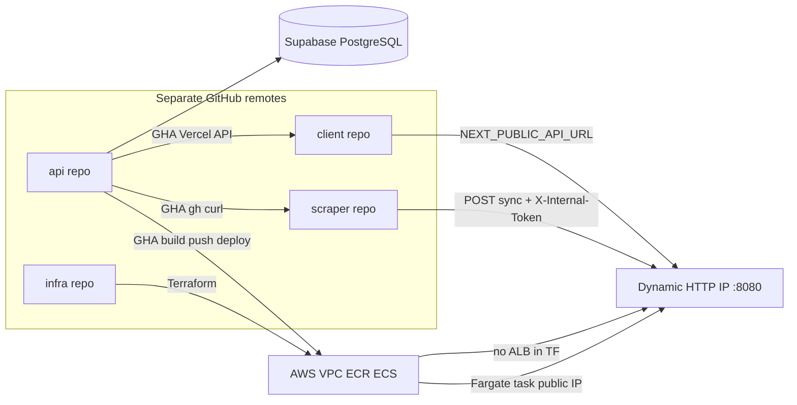

# Runners List: Current Architecture and Recommended Enhancements

## How the pieces fit together (production)

**Data flow:** The Python scraper (cron) POSTs bulk events to `/api/v1/internal/sync` with a shared secret header. The Next.js app calls `GET /api/v1/events` (see [client/src/utils/loadEvents.ts](client/src/utils/loadEvents.ts)). The Go service persists via GORM.

**Important nuance:** [project_context.md](project_context.md) lists only two public-ish endpoints; the codebase also exposes **users** (`/register`, `/login`, `/users`) and **protected event mutations** under `/api/v1/protected/...` ([api/cmd/routes.go](api/cmd/routes.go)). The doc is slightly behind the code.

---

## Go architecture (learning map)

The API follows a **ports and adapters** layout that maps cleanly to Go refresher topics:

| Path                                                                       | Role                                                         | Study focus                                                                                          |
| -------------------------------------------------------------------------- | ------------------------------------------------------------ | ---------------------------------------------------------------------------------------------------- |
| [api/cmd/main.go](api/cmd/main.go), [api/cmd/routes.go](api/cmd/routes.go) | Composition root: wire DB → repos → services → HTTP handlers | Manual DI, `fiber.App`, route groups                                                                 |
| [api/internal/core/domain](api/internal/core/domain)                       | Entities                                                     | Struct tags (`json`, `gorm`, `validate`); note **domain is coupled to GORM** (`gorm.Model` embedded) |
| [api/internal/port](api/internal/port)                                     | Repository interfaces (+ mocks)                              | **Interfaces satisfied implicitly**; test doubles                                                    |
| [api/internal/core/service](api/internal/core/service)                     | Use cases                                                    | Errors as sentinels, orchestration                                                                   |
| [api/internal/adapter/http](api/internal/adapter/http)                     | HTTP adapters                                                | `fiber.Ctx`, status codes, DTOs like `SyncRequest`                                                   |
| [api/internal/adapter/repository](api/internal/adapter/repository)         | GORM implementations                                         | `port` interface → concrete DB code                                                                  |
| [api/internal/adapter/middleware](api/internal/adapter/middleware)         | Cross-cutting                                                | API key auth ([internal-auth.go](api/internal/adapter/middleware/internal-auth.go)), JWT             |

**Observed gaps useful for exercises:**

- [api/internal/config/config.go](api/internal/config/config.go) is effectively **empty**; DB and middleware read `os.Getenv` directly. A classic Go exercise is a **typed config struct** loaded once at startup (e.g. `caarlos0/env`, or manual validation) and injected into services/middleware.
- **Domain vs persistence:** `domain.Events` embeds `gorm.Model` and lives beside HTTP JSON—fine for a small app, but a common evolution is **separate API/DTO structs** and a DB model if you want a cleaner hexagon.
- Typo in domain: `RegisterationURL` in [api/internal/core/domain/events.go](api/internal/core/domain/events.go) (JSON tag masks it for clients; renaming needs a careful DB column migration).

---

## Infrastructure (what Terraform + CI actually do)

- **Terraform** ([infra/terraform](infra/terraform)): VPC/subnets/IGW, ECS cluster (Fargate Spot default), ECR, task definition with env vars for DB/JWT/internal key, service with `assign_public_ip = true`, `desired_count` gated by `api_enabled`. **No `backend` block** → state is local/default unless configured elsewhere (aligns with “Remote State” in [project_context.md](project_context.md) future list).
- **API deploy** ([api/.github/workflows/deploy-aws.yml](api/.github/workflows/deploy-aws.yml)): ECR push, render new task definition with secrets, ECS deploy, then **discover new public IP** and update **scraper** `API_URL` and **Vercel** `NEXT_PUBLIC_API_URL`.
- **Operational tradeoff:** Container Insights off and CloudWatch logging commented out in [infra/terraform/3_compute.tf](infra/terraform/3_compute.tf) for cost—good for hobby tier, limits incident debugging.

---

## Recommended enhancements (API)

Prioritized for learning value and production hygiene:

1. **Configuration package**
  Centralize env loading + validation; fail fast on missing `DB_HOST`, `INTERNAL_API_KEY`, etc. Inject config into auth middleware or pass expected key from main (easier to test than `os.Getenv` inside middleware).
2. **Health and readiness for ECS**
  Add `GET /health` (liveness) and optionally `GET /ready` (DB ping). Wire ECS **health checks** in the task definition once you have stable HTTP checks—today there is no ALB health check in Terraform.
3. **Graceful shutdown**
  Use `fiber` with `app.Shutdown()` on `SIGTERM` (ECS sends this on stop/replace). Teaches signal handling and draining in Go.
4. **HTTPS and stable public URL**
  Not only UX: browsers and Vercel may treat mixed content or non-HTTPS APIs strictly in some setups. A **single stable hostname** removes the entire “update Vercel + scraper on every deploy” branch (or reduces it to DNS-only changes).
5. **API contract and consistency**
  - Add **OpenAPI** (swaggo or manual YAML) so the Next.js client and scraper share one spec.  
  - **Pagination/filtering** on `ListEvents` (query params + `LIMIT/OFFSET` or cursor) before the dataset grows.  
  - **Rate limiting** on public `GET /events` (Fiber middleware or edge/WAF later).
6. **Security hardening**
  - DB DSN in [database.go](api/internal/adapter/database/database.go) uses `sslmode=disable`; Supabase pooler typically supports TLS—move to `**sslmode=require`** (or verify pooler docs for `verify-full`).  
  - Consider **constant-time compare** for internal API key (`subtle.ConstantTimeCompare`) to reduce timing side channels (minor for this use case, good habit).
7. **Sync endpoint behavior**
  [sync.go](api/internal/adapter/http/sync.go) skips invalid dates silently in a loop; returning **partial success** with per-row errors improves scraper operability.

---

## Recommended enhancements (infra / platform)

1. **Stable ingress (highest leverage)**
  Add **Application Load Balancer + target group** (HTTP/HTTPS) pointing at the ECS service in **private subnets** (preferred) or keep public subnets but front with ALB. Attach **ACM certificate** and a **custom domain** (Route 53). Cost note matches your doc (~18/mo ballpark for ALB); alternative patterns include **API Gateway HTTP API** or a small **CloudFront** distribution—pick based on TLS, caching, and WAF needs.
2. **Terraform remote state**
  S3 bucket + DynamoDB table for state locking; restrict bucket policy to your AWS account. Enables safe collaboration and CI applies without local state drift.
3. **Secrets**
  Move DB password, `JWT_SECRET`, `INTERNAL_API_KEY` from plain task `environment` to **Secrets Manager** or **SSM Parameter Store** and reference `secrets` in the task definition. Reduces exposure in AWS console and Terraform variable leakage risk.
4. **GitHub Actions → AWS auth**
  Replace long-lived `AWS_ACCESS_KEY_ID` with **OIDC** (`aws-actions/configure-aws-credentials` with `role-to-assume`). Same for any cross-repo automation where possible.
5. **Observability (incremental)**
  Re-enable **awslogs** for the API container when debugging; add **alarms** on ECS service running count / ALB 5xx. Optional: structured JSON logs from Go for CloudWatch Insights.
6. **High availability (optional)**
  `desired_count > 1` with ALB; Fargate Spot **capacity provider strategy** with some on-demand base capacity if you need fewer interruptions.
7. **Multi-repo coordination**
  Document **contract-first** workflow: OpenAPI in api repo → generated or hand-maintained types in client/scraper; version the API (`/v1` already helps). Consider a small **shared** repo or package only if duplication becomes painful (you can still keep separate remotes).

---

## Suggested learning sequence (Go refresh)

1. Trace one request: `routes.go` → `EventHandler.ListEvents` → `EventService` → `port.EventRepository` → GORM adapter.
2. Implement **config loading** in `internal/config` and thread it through `main`.
3. Add `**/health`** and **graceful shutdown** (small, visible wins).
4. Read Terraform **3_compute.tf** alongside AWS ECS docs to see how task defs map to your running binary.

---

## What not to change without intent

- **Separate remotes:** Keep modules independent; avoid a monolithic repo merge unless you want tooling simplicity over repo isolation.  
- **Cost controls:** ALB and extra logging have real monthly cost—stage changes (e.g. ALB only when you are ready to pay or need HTTPS for production users).

