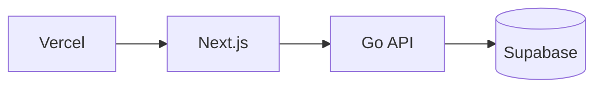

# Runners List Web

> **Next.js frontend for Malaysian running events aggregation platform**

[](https://nextjs.org)
[](https://www.typescriptlang.org)
[](https://tailwindcss.com)
[](https://vercel.com)

---

## Overview

The **Runners List Web** is the user-facing frontend for the Runners List Platform. It displays running events across Malaysia with filtering and search capabilities.

### Live Site
[runners-list-web.vercel.app](https://runners-list-web.vercel.app)

---

## Architecture



### Data Flow

1. **Build Time (getStaticProps):** Fetches events from API
2. **ISR:** Revalidates every 60 seconds
3. **Fallback:** Returns empty array if API is unavailable

---

## Tech Stack

| Technology | Version | Purpose |
|------------|---------|---------|
| Next.js | 15.x | React framework with SSG/ISR |
| React | 18.x | UI library |
| TypeScript | 5.x | Type safety |
| Tailwind CSS | 3.x | Styling |
| Shadcn UI | - | Component library |
| Framer Motion | 12.x | Animations |

---

## Quick Start

### Prerequisites
- Node.js 18+
- npm or yarn

### Installation

```bash
# Clone
git clone https://github.com/aniqaqill/runners-list-web.git
cd runners-list-web

# Install dependencies
npm install

# Set environment variables
cp .env.example .env.local
# Edit .env.local with your API URL
```

### Environment Variables

```env
# API URL (required for data fetching)
NEXT_PUBLIC_API_URL=http://localhost:8080/api/v1
```

### Development

```bash
npm run dev
```

Open [http://localhost:3000](http://localhost:3000)

### Build

```bash
npm run build
npm start
```

---

## Project Structure

```
src/
├── components/          # React components
│   ├── events-grid.tsx # Main event display
│   ├── filter-panel.tsx # Search & filters
│   ├── navbar.tsx      # Navigation
│   └── ui/             # Shadcn components
├── pages/
│   ├── _app.tsx        # App wrapper
│   └── index.tsx       # Home page (SSG)
├── styles/
│   └── globals.css     # Tailwind imports
├── types/
│   └── event.ts        # TypeScript types
└── utils/
    └── loadEvents.ts   # API data fetching
```

---

## API Integration

### Data Fetching

```typescript
// src/utils/loadEvents.ts
export const loadEvents = async (): Promise<Event[]> => {
  const apiUrl = process.env.NEXT_PUBLIC_API_URL;
  
  if (apiUrl) {
    const res = await fetch(`${apiUrl}/events`, { next: { revalidate: 60 } });
    if (res.ok) {
      const response = await res.json();
      return response.data || response;
    }
  }
  
  return [];
};
```

### Event Schema

```typescript
interface Event {
  name: string;
  location: string;
  state: string;
  distance: string;
  date: string;
  description: string;
  registration_url: string;
}
```

---

## Deployment

### Vercel (Production)

1. Connect repository to Vercel
2. Set environment variable:
   - `NEXT_PUBLIC_API_URL` = `http://<API_IP>:8080/api/v1`
3. Deploy

> **Note:** `NEXT_PUBLIC_*` variables are baked at build time. You must redeploy after changing them.

### Zero-Cost IP Automation

The API deployment workflow automatically updates the Vercel environment variable when the API IP changes. However, you still need to **redeploy Vercel** to apply the new value.

---

## Features

- **Event Listing:** Browse all upcoming running events
- **Search:** Filter by event name
- **State Filter:** Filter by Malaysian state
- **Distance Filter:** Filter by race distance
- **Dark Mode:** Toggle between light and dark themes
- **Responsive:** Mobile-first design

---

## Related Repositories

| Repository | Description |
|------------|-------------|
| [runners-list-api](https://github.com/aniqaqill/runners-list-api) | Go API backend |
| [runners-list-scraper](https://github.com/aniqaqill/runners-list-scraper) | Python event scraper |

---

## License

MIT
