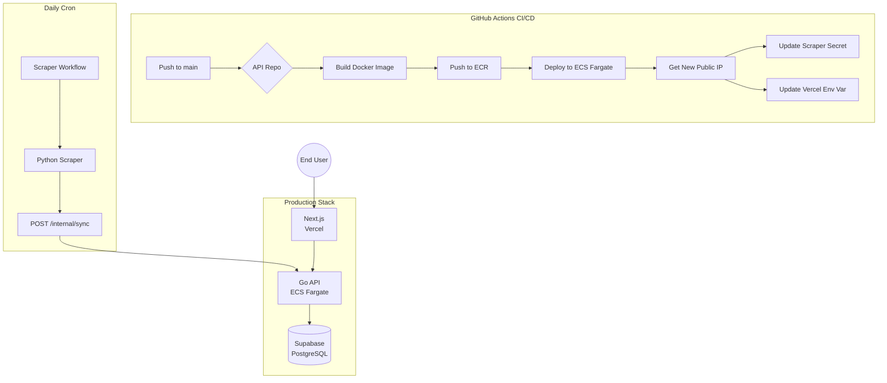

# Project Context: Runners List Platform

## Overview
A **running events aggregation platform** for Malaysia that scrapes event data from a Blogger page and serves it through a Go API to a Next.js frontend hosted on Vercel.

**Live URLs:**
- **Frontend:** [runners-list-web.vercel.app](https://runners-list-web.vercel.app)
- **API:** `http://<DYNAMIC_IP>:8080/api/v1/events` (IP changes on each deployment)

---

## Architecture (Production - January 2026)



---

## Technology Stack

| Layer | Technology | Details |
|-------|------------|---------|
| **Frontend** | Next.js 15 | Vercel hosting, ISR with 60s revalidation |
| **Backend** | Go 1.24 + Fiber | AWS ECS Fargate (Spot instances) |
| **Database** | PostgreSQL 15 | Supabase Transaction Pooler |
| **Scraper** | Python 3.11 | Selenium + BeautifulSoup, daily cron |
| **CI/CD** | GitHub Actions | Auto-deploy + Zero-Cost IP sync |

---

## Repository Structure

```
runners-list-monorepo/
├── api/                    # Go API (Fiber + GORM)
│   └── .github/workflows/deploy-aws.yml
├── client/                 # Next.js Frontend
│   └── src/utils/loadEvents.ts
├── scraper/                # Python Scraper
│   └── .github/workflows/scraper.yml
└── infra/                  # Infrastructure (separate GitHub repo)
    ├── .github/workflows/terraform.yml  # GitOps workflow
    └── terraform/          # Terraform IaC
        ├── terraform.tfvars    # Settings (source of truth)
        ├── _provider.tf, _variables.tf
        ├── 1_network.tf, 2_container.tf, 3_compute.tf
        └── outputs.tf, BEST_PRACTICES.md
```

---

## Key Features

### Terraform GitOps (Infrastructure as Code)
All AWS infrastructure is managed via Terraform with **`terraform.tfvars` as source of truth**:
- **Toggle API:** Edit `terraform.tfvars` → `api_enabled = true/false` → push
- **GitHub Actions:** Auto-applies on push to `runners-list-infra` repo
- **No runtime overrides:** Code defines state, not variables passed at runtime

### Zero-Cost IP Automation
Since AWS ECS Fargate assigns a new public IP on each deployment, the CI/CD pipeline automatically:
1. Retrieves the new IP after deployment
2. Updates `API_URL` secret in `runners-list-scraper` repo
3. Updates `NEXT_PUBLIC_API_URL` env var in Vercel via API

### API Endpoints

| Method | Endpoint | Auth | Purpose |
|--------|----------|------|---------|
| `GET` | `/api/v1/events` | None | List all events |
| `POST` | `/api/v1/internal/sync` | API Key | Bulk sync from scraper |

### Data Schema

```go
type Events struct {
    gorm.Model
    Name            string    `json:"name"`
    Location        string    `json:"location"`
    State           string    `json:"state"`
    Distance        string    `json:"distance"`
    Date            time.Time `json:"date"`
    Description     string    `json:"description"`
    RegistrationURL string    `json:"registration_url"`
}
```

---

## GitHub Secrets Required

### API Repository (`runners-list-api`)

| Secret | Purpose |
|--------|---------|
| `AWS_ACCESS_KEY_ID` | IAM user for ECS/ECR |
| `AWS_SECRET_ACCESS_KEY` | IAM user secret |
| `SUPABASE_DB_HOST` | e.g., `aws-1-ap-southeast-2.pooler.supabase.com` |
| `SUPABASE_DB_USER` | e.g., `postgres.project_ref` |
| `SUPABASE_DB_PASSWORD` | Database password |
| `JWT_SECRET` | JWT signing key |
| `INTERNAL_API_KEY` | Scraper authentication |
| `GH_PAT` | GitHub Personal Access Token (for cross-repo secrets) |
| `VERCEL_TOKEN` | Vercel API token (Full Account scope) |
| `VERCEL_ORG_ID` | Vercel user/team ID |
| `VERCEL_PROJECT_ID` | Vercel project ID |

### Scraper Repository (`runners-list-scraper`)

| Secret | Purpose |
|--------|---------|
| `API_URL` | Auto-updated by API deployment |
| `INTERNAL_API_KEY` | Same as API repo |
| `SCRAPE_URL` | Target Blogger page |

### Infrastructure Repository (`runners-list-infra`)

| Secret | Purpose |
|--------|---------|
| `AWS_ACCESS_KEY_ID` | Same as API repo |
| `AWS_SECRET_ACCESS_KEY` | Same as API repo |
| `SUPABASE_DB_HOST` | Database host |
| `SUPABASE_DB_USER` | Database user |
| `SUPABASE_DB_PASSWORD` | Database password |
| `JWT_SECRET` | JWT signing key |
| `INTERNAL_API_KEY` | Scraper API key |

---

## Monthly Cost Estimate

| Service | Cost |
|---------|------|
| AWS Fargate Spot | ~$3-5 |
| ECR Storage | ~$0.10 |
| Supabase | Free tier |
| Vercel | Free tier |
| GitHub Actions | Free tier |
| **Total** | **~$5/month** |

---

## Future Enhancements

1. ~~**Terraform GitOps:**~~ ✅ Completed - All infra codified
2. **Stable URL:** Add Application Load Balancer (~$18/month)
3. **Custom Domain:** Route53 + ACM for HTTPS
4. **Remote State:** S3 backend for Terraform state (team-friendly)
5. **Monitoring:** Re-enable CloudWatch logs when debugging needed
6. **Mobile App:** React Native client consuming the same API
